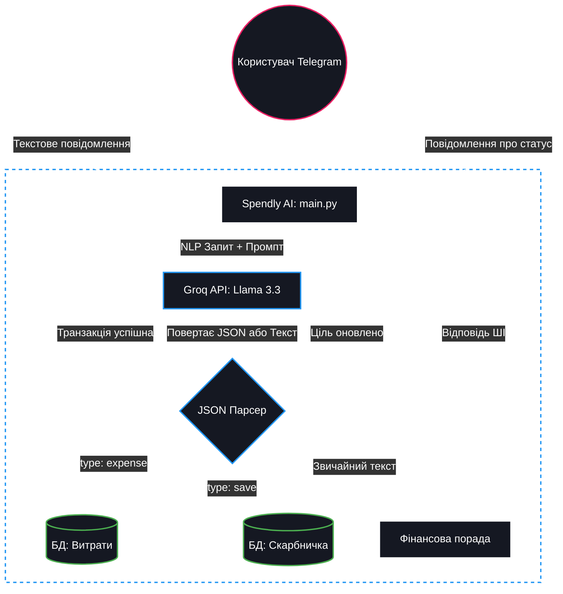

# 💰 Spendly AI — Розумний фінансовий асистент

**Elevator Pitch:** Spendly AI — це персональний Telegram-бот, який перетворює нудний облік фінансів на просте спілкування. Більше ніяких складних таблиць та форм: просто напиши "купила каву за 120", і штучний інтелект автоматично розпізнає категорію, суму та збереже це до твоєї бази даних.

Бот доступний у Telegram: **[@SpendAIlyBot](https://t.me/SpendAIlyBot)**

---

## 🎯 Цільова аудиторія
- **Люди, які не люблять складні додатки:** ті, кому легше написати одне повідомлення в месенджер, ніж заповнювати форми в банківських чи облікових програмах.
- **Студенти та молодь:** для базового контролю своїх витрат та накопичення коштів у "скарбничку".
- **Усі, хто хоче оптимізувати бюджет:** бот підтримує режим діалогу, де може дати персоналізовані фінансові поради.

---

## 🛠 Технічна реалізація та ШІ-патерни

Проєкт побудований на сучасній асинхронній архітектурі Python (Aiogram 3) з використанням бази даних SQLite (через SQLAlchemy ORM). Ядром системи є мовна модель Llama 3.3 (Groq API).

У проєкті реалізовано просунутий ШІ-патерн:
1. **NLP to Structured Data (Витягнення структурованих даних):** Модель отримує неструктурований текст користувача (наприклад, "відклала 5000 на машину") і, керуючись жорстким системним промптом, повертає стандартизований JSON. Бот парсить цей JSON та автоматично викликає відповідні функції бази даних (додавання витрати або оновлення скарбнички).
2. **Contextual AI Chat:**
   Якщо повідомлення не містить фінансової транзакції, ШІ переходить у режим фінансового консультанта, надаючи поради без спроб записати це в базу даних.
3. **Finite State Machine (FSM):**
   Для складних багатокрокових операцій (наприклад, створення нової цілі накопичення) використовується машина станів Aiogram, що гарантує цілісність введених даних.

---

## 🚀 Інструкція із запуску (Локально)

### 1. Попередні вимоги
- Встановлений **Python 3.11**
- Отриманий `BOT_TOKEN` від @BotFather
- Отриманий `GROQ_API_KEY` від Groq Cloud

### 2. Клонування та встановлення
```bash
git clone [https://github.com/anastasiia-i-andreiko/spendlyai.git](https://github.com/anastasiia-i-andreiko/spendlyai.git)
cd spendlyai
pip install -r requirements.txt
```
### 3. Налаштування середовища

Створіть файл .env у кореневій папці та додайте ключі:
```bash
BOT_TOKEN=ваш_токен_телеграм
GROQ_API_KEY=ваш_ключ_groq
```
### 4. Запуск
```bash
python main.py
```

---

## ☁️ Деплой (Хмарний хостинг)

Проєкт містить файл Procfile (worker: python main.py) та runtime.txt, що робить його повністю готовим до безперервного деплою на PaaS-платформах (таких як Heroku, Railway або Render) у форматі background worker.

---

## 📊 Архітектура системи

На діаграмі нижче показано потік перетворення природної мови користувача на SQL-транзакції за допомогою ШІ.

